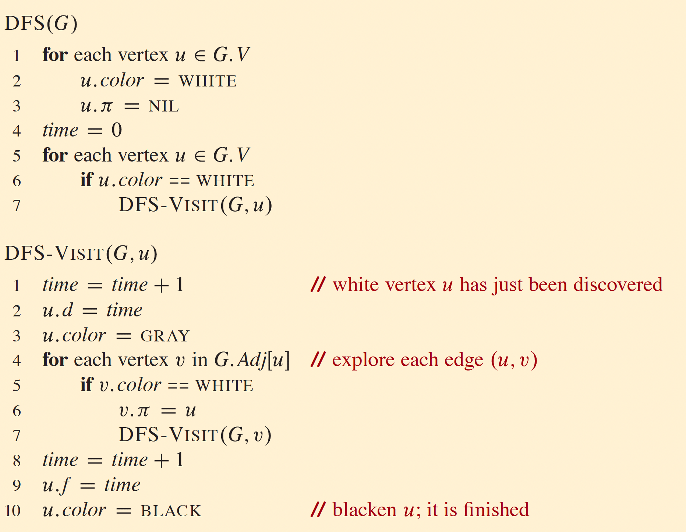

# Before we start

- hw4 is due June 15th, 11:59 p.m.
- office hours in final week
  - Ethan (Watershed 2nd Floor Conference Room)
    - Friday June 9th, 4:00 - 5:00 pm
  - Henry
    - todo

---

# Final Review

## Topics

- Lists
- Trees
- Sorting
- Graphs

---

# Lists

todo

---

# Trees

- BST
- Red-Black Tree
- Min/Max Heap
- B-Tree

---

## B-Tree

todo

---

# Sorting

- Insertion Sort
- Selection Sort
- Merge Sort
- Quick Sort

---

# Graphs

- BFS \& DFS
- Minimum Spanning Tree

---

## Definitions

Let $G = (V, E)$ denote a graph,
where $V$ is the set of vertices and $E$ is the set of edges.

**Defn**
$G$ is _sparse_ if $|E| << |V|^2$.

_dense_?

---

## Definitions

Let $G = (V, E)$ denote a graph,
where $V$ is the set of vertices and $E$ is the set of edges.

**Defn**
$G$ is _sparse_ if $|E| << |V|^2$.

**Defn**
$G$ is _dense_ if $|E| \approx |V|^2$.

**Defn**
$G$ is connected if for all $v \in V$,
there is $(v, \_) \in E$.
There is a path from any vertex to any other vertex.

---

## Representation of Graph

adjacency list

```hs
type Neighbor = [Node]
map<Node, Neighbor>
```

adjacency matrix $A$

<!-- ```hs
type E = Edges
A i j =
  | (i, j) in E = 1
  | otherwise   = 0
``` -->

$$
a_{ij} = \begin{cases}
  1 \quad \text{if } (i, j) \in E \\
  0 \quad \text{otherwise}
\end{cases}
$$

---

### Pros & Cons?

Comparing Adj List and Adj Matrix

---

### Pros & Cons?

what are some advantages/disadvantages of using a adj list?

- +: easier weights on edges
- -: $hasEdge: G \rightarrow Bool$ time complexity

what are some advantages/disadvantages of using a adj matrix?

- +: if undirected, $A$ must be symmetric
- +: faster computation (matrix algebra easier parallelized)
- +: $O(1)$ for $hasEdge$
- -: needs more memory

---

## Breadth-first search


---

## Depth-first search



---

### Pros & Cons?

Comparing BFS and DFS

---

### Pros & Cons?

Comparing BFS and DFS:

BFS: shortest path

DFS: topological sort

---

# Minimum Spanning Tree

Let graph $G = (V, E)$ be weighted.
That is, for all $e \in E$,
there is $w_e \in \mathbb{R}$.

We want to find a subset $T \subseteq E$
such that,

$$
\min \quad \sum_{e \in T} w_e
$$

subject to

1. each $v \in V$ is connected to at least some edge $(\_, v)$ or $(v, \_) \in T$.
2. $T$ is connected and acyclic, $|T| = |V| - 1$.

---

## Kruskal


---

## Prim


---

## Example Graph


